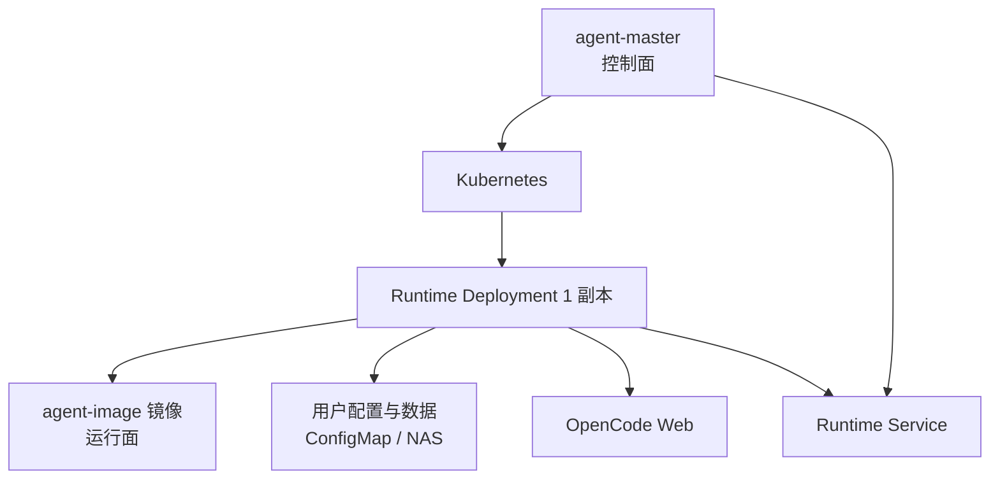

# agent-image · OpenCode Runtime 镜像

> OpenCode Runtime 镜像构建仓库：为 `agent-master` 创建用户级 Runtime Deployment 提供标准容器镜像。本仓库只维护镜像本身，运行面由 OpenCode 实际承载。

## 1. 定位与目标

`agent-image` 是 `agent-master` 调度用户 Runtime 时使用的 OpenCode 镜像构建仓库。它不负责 Runtime 调度、用户鉴权、Redis 租约、Kubernetes 资源管理或 Agent API 代理。

架构分工：
- **控制面**：由 `agent-master` 负责，承担 Runtime 生命周期管理、多租户调度、实例伸缩维护。
- **运行面**：由本镜像提供，内置 OpenCode 引擎，实际执行智能体会话与工具调用。

一句话定位：

- 提供可被 Kubernetes Deployment 启动的 OpenCode Runtime 镜像。
- 固定以 OpenCode Web 模式监听 `4096` 端口。
- 提供镜像内默认 `/app` 项目骨架，作为本地运行和默认兜底示例。
- 真实部署时由 `agent-master` 按用户配置，将用户数据通过 Kubernetes ConfigMap 或存储卷挂载到容器。

设计目标：

- 镜像稳定，配置外置。
- Runtime 容器监听 `0.0.0.0:4096`，供 Kubernetes Service 访问。
- 默认项目结构遵循 OpenCode 官方项目级配置目录约定。
- 不把真实用户数据、真实凭证、私有 plugins、私有 skills、私有 tools 或业务配置烘进镜像。

## 2. 总体架构关系

`agent-master` 负责控制面，`agent-image` 只负责运行面镜像。



边界划分：

| 仓库 | 职责 | 不负责 |
|---|---|---|
| `agent-master` | Runtime 生命周期、多集群调度、Redis 租约、Deployment + Service、Agent API 代理、用户配置挂载渲染 | OpenCode 镜像构建 |
| `agent-image` | OpenCode Runtime 镜像构建、默认 `/app` 项目骨架、启动命令和基础工具环境 | 调度、鉴权、Redis、Kubernetes 控制面、代理逻辑 |

## 3. 官方依据

### 3.1 安装方式

OpenCode 支持通过 npm 安装：

```bash
npm install -g opencode-ai
```

本镜像使用该方式安装 OpenCode CLI。

### 3.2 Web 启动方式

OpenCode Web 使用以下命令指定监听端口和地址：

```bash
opencode web --port 4096 --hostname 0.0.0.0
```

本镜像固定使用 Web 模式启动，不使用 `opencode serve`。

原因：本 Runtime 需要加载运行项目级 OpenCode 配置中的 plugins；`serve` 模式不作为本镜像默认启动模式。

### 3.3 项目级配置目录

OpenCode 项目级配置位于项目根目录下的 `.opencode/`，本仓库提供以下最小骨架：

```text
.opencode/
├── opencode.json
├── agents/
├── commands/
├── modes/
├── plugins/
├── skills/
├── tools/
└── themes/
```


## 4. 镜像构建与启动

镜像构建逻辑：

1. 基于 Node.js 22 slim 镜像提供 Node / npm 环境。
2. 安装 Python 3、pip、venv、Git、curl、bash、CA 证书等基础工具。
3. 使用 `npm install -g opencode-ai` 安装 OpenCode。
4. 将仓库内默认 `AGENTS.md` 和 `.opencode/` 复制到容器 `/app`。
5. 暴露 `4096` 端口，并以 OpenCode Web 模式启动。

关键 Dockerfile 片段：

```dockerfile
FROM docker.1ms.run/library/node:22-slim

RUN npm install -g opencode-ai

WORKDIR /app
COPY .opencode/opencode.json .opencode/
COPY .opencode/agents/ .opencode/agents/
COPY .opencode/commands/ .opencode/commands/
COPY .opencode/modes/ .opencode/modes/
COPY .opencode/plugins/ .opencode/plugins/
COPY .opencode/skills/ .opencode/skills/
COPY .opencode/tools/ .opencode/tools/
COPY .opencode/themes/ .opencode/themes/
COPY AGENTS.md .

EXPOSE 4096
CMD ["opencode", "web", "--port", "4096", "--hostname", "0.0.0.0"]
```

容器内默认项目目录：

```text
/app
```

容器启动命令：

```bash
opencode web --port 4096 --hostname 0.0.0.0
```

## 5. 仓库结构

```text
.
├── AGENTS.md
├── Dockerfile
├── README.md
├── .dockerignore
├── .gitignore
└── .opencode/
    ├── opencode.json
    ├── agents/
    ├── commands/
    ├── modes/
    ├── plugins/
    ├── skills/
    ├── tools/
    └── themes/
```

说明：

- `AGENTS.md` 是镜像内默认项目的规则示例，Docker 构建时复制到容器 `/app/AGENTS.md`。
- `.opencode/opencode.json` 是默认项目级 OpenCode 配置入口示例。
- `.opencode/agents/`、`.opencode/commands/`、`.opencode/modes/`、`.opencode/plugins/`、`.opencode/skills/`、`.opencode/tools/`、`.opencode/themes/` 是 OpenCode 项目级配置目录。
- 镜像内默认 `/app` 会在真实 Runtime Deployment 中被用户根目录挂载覆盖，这是预期行为。

## 6. 与 agent-master 的运行契约

### 6.1 Runtime 归属

Runtime 实例由 `agent-master` 按用户创建和复用：

```text
userId -> Runtime
```

Runtime 不按 scene 创建，scene 不参与 Runtime Redis Key、Deployment、Service、镜像选择或调度均衡。

### 6.2 容器内目录契约

真实部署时，`agent-master` 创建 Runtime Deployment，并按以下规则挂载：

```text
{runtime.workdir}/{userId} -> /app
{runtime.scenes.<scene>}/AGENTS.md -> /app/{scene}/AGENTS.md
{runtime.scenes.<scene>}/.opencode -> /app/{scene}/.opencode
```

容器内最终形态：

```text
/app/
├── AGENTS.md
├── .opencode/
└── {scene}/
    ├── AGENTS.md
    ├── .opencode/
    └── ... 用户工作文件与运行产物
```

### 6.3 用户默认配置

用户默认项目配置来自用户根目录：

```text
{runtime.workdir}/{userId}/AGENTS.md
{runtime.workdir}/{userId}/.opencode/
```

根挂载后自然成为：

```text
/app/AGENTS.md
/app/.opencode/
```

用户默认 `.opencode/` 可以包含完整 OpenCode 项目级配置：

```text
opencode.json
agents/
commands/
modes/
plugins/
skills/
tools/
themes/
```

### 6.4 预设 scene 配置

平台统一管理的预设 scene 配置来自：

```text
{runtime.scenes.<scene>}/AGENTS.md
{runtime.scenes.<scene>}/.opencode/
```

挂载到：

```text
/app/{scene}/AGENTS.md
/app/{scene}/.opencode/
```

scene `.opencode/` 只承接约束材料，建议包含：

```text
opencode.json
agents/
skills/
tools/
```

scene `.opencode/` 不放：

```text
plugins/
commands/
modes/
```

### 6.5 会话目录

`agent-master` 代理 OpenCode 创建会话时，将请求体扩展参数 `scene` 转换为 OpenCode 官方 `directory` query 参数：

```text
scene -> directory=/app/{scene}
```

示例：

```http
POST /session?directory=/app/coding
```

`agent-image` 不处理 `scene` 字段；`scene` 的校验、转换和移除由 `agent-master` 完成。

### 6.6 动态能力安装与重启

动态安装用户级 skills / tools / plugins 时，推荐写入用户默认项目配置目录：

```text
{runtime.workdir}/{userId}/.opencode/skills/
{runtime.workdir}/{userId}/.opencode/tools/
{runtime.workdir}/{userId}/.opencode/plugins/
```

容器内对应：

```text
/app/.opencode/skills/
/app/.opencode/tools/
/app/.opencode/plugins/
```

OpenCode Web 需要重启后才能稳定重新加载项目级配置。重启由 `agent-master` 提供的当前用户 Runtime 重启接口完成：

```http
POST /api/v1/runtime/restart
```

`agent-image` 不在容器内提供自重启控制接口，不负责管理 OpenCode 进程重启策略。

### 6.7 挂载前置路径

Runtime 创建或重启前，`agent-master` 的初始化流程必须确保以下路径存在：

```text
{runtime.workdir}/{userId}/
{runtime.workdir}/{userId}/AGENTS.md
{runtime.workdir}/{userId}/.opencode/
{runtime.workdir}/{userId}/{scene}/
{runtime.scenes.<scene>}/AGENTS.md
{runtime.scenes.<scene>}/.opencode
```

`agent-image` 镜像不负责创建 NAS 目录，不负责初始化用户工作区，不负责管理预设 scene 源目录。

## 7. Kubernetes 部署建议

`agent-image` 镜像内置的 `/app`、`AGENTS.md` 和 `.opencode/` 只作为默认示例。真实部署时，`agent-master` 通过 Kubernetes volume / volumeMount 注入用户工作目录与预设 scene 配置。

Deployment 必须满足：

- 容器镜像使用 `agent-image`。
- 容器端口为 `4096`。
- 容器监听地址为 `0.0.0.0`。
- 启动命令为 `opencode web --port 4096 --hostname 0.0.0.0`。
- 由 Kubernetes Service 暴露给 `agent-master` 代理访问。
- 真实凭证通过 Secret、环境变量或受控挂载文件注入。
- 用户目录、用户默认配置和预设 scene 配置通过 volume / volumeMount 注入。

建议安全上下文：

```yaml
securityContext:
  allowPrivilegeEscalation: false
  capabilities:
    drop:
      - ALL
```

如果业务确认 OpenCode、插件和挂载目录都不需要 root 权限，可以进一步配置 `runAsNonRoot: true`、`runAsUser`、`runAsGroup`。如果启用 `readOnlyRootFilesystem: true`，需要为 OpenCode 工作目录、临时目录、插件运行目录和用户 workdir 提供可写 volume。

## 8. 构建与验证

 构建镜像：

```bash
docker build -t agent-image:local .
```

检查基础工具：

```bash
docker run --rm agent-image:local node --version
docker run --rm agent-image:local npm --version
docker run --rm agent-image:local python3 --version
docker run --rm agent-image:local opencode --version
```

运行 Runtime：

```bash
docker run --rm -p 4096:4096 agent-image:local
```

健康检查：

```bash
curl -fsS http://127.0.0.1:4096/global/health
```

## 9. 安全边界

仓库和镜像不保存：

- 接口密钥、Token、Cookie、账号密码或密钥。
- `.env` 文件。
- kubeconfig 文件。
- 证书或私钥。
- 真实用户工作区数据。
- 私有 plugins、skills、tools 或业务配置。
- 客户材料、内部地址或未公开指标。

真实模型供应商凭证、插件凭证和业务凭证应在运行时通过 Kubernetes Secret、受控环境变量或受控挂载文件注入。

## 10. 设计边界

`agent-image` 负责：

- OpenCode Runtime 镜像构建。
- 默认 `/app` 项目骨架。
- OpenCode Web 启动命令。
- 基础工具环境。

`agent-image` 不负责：

- Runtime 创建、查询、关闭。
- 用户鉴权或 `x-user-id` 注入。
- Redis 状态、租约和 TTL。
- Kubernetes 多集群调度。
- Deployment / Service 创建和删除。
- Agent API 代理。
- `scene` 校验和 `directory=/app/{scene}` 转换。
- NAS 用户目录和预设 scene 源目录初始化。

这些能力由 `agent-master` 承接。
